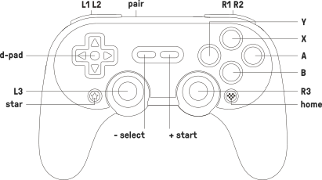

# {{ page.brand }} {{ page.model }}

* [Product page](https://www.8bitdo.com/sn30-pro-plus/)
* [Manual](https://download.8bitdo.com/Manual/Controller/SN30-Pro+/SN30_Pro+_Manual.pdf)
* [FAQ](https://support.8bitdo.com/faq/sn30-pro-plus.html)
* Connections: Bluetooth and USB-C

## Overview

At the top edge of the controller, between the L and R buttons, there is a "Bluetooth pair" button, a USB-C connection, and a red LED.

At the bottom edge of the controller, there are 4 green LEDs.

## Power-on modes

Use these combinations to turn on the gamepad. They work on both Bluetooth mode and USB mode. For USB mode, you don't need to press START, with the controller off, just hold the other button(s) while plugging the USB cable.

Combination     | Mode            | LEDs                         | Vendor id | Product id | Device name                                                   |
--------------- | --------------- | --------------------------------------- | ---- | ---- | ------------------------------------------------------------- |
START           | Last used mode  | As many as last mode                    |      |      |                                                               |
B + START       | Android/Dinput  | 1 LED blinks                            | 2dc8 | 6002 or 6102 | *8Bitdo SF30 Pro   8BitDo SN30 Pro+*                  |
X + START       | Xinput          | 2 LEDs blink                            | 045e | 028e or 02e0 | *Microsoft X-Box 360 pad* Xbox360 Controller          |
A + START       | Mac             | 3 LEDs blink                            | 054c | 05c4 | *Sony Computer Entertainment Wireless Controller* DualShock 4 |
Y + START       | Nintendo Switch | 4 LEDs blink in a back-and-forth motion | 057e | 2009 | *Nintendo Co., Ltd. Switch Pro Controller*                    |
L1 + R1 + START | Firmware update | Red LED blinks constantly               | 2dc8 | 5750 | *8BitdoJoy 8Bitdo* Bootloader                                 |

## Power-off

Automatically turns off after 15 minutes without activity.

Hold for...  | Action
------------ | ------
START for 3s | Power off

## Battery

Removable 1000mAh Li-on battery, 4 hours of charging time, 20 hours of play time.

Alternatively, two AA batteries, 20 hours of play time.

LED          | Meaning
------------ | -------
RED blinking | Low battery
RED solid    | Charging
RED off      | Fully charged

## Other mappings

Button | Dinput | Xinput | Switch
------ | ------ | ------ | ------
STAR   | Turbo  | Turbo  | Screenshot
HEART  |        | HOME   | HOME

To toggle the *turbo* function, hold down any button and then press STAR.
