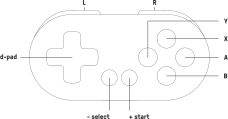

# {{ page.brand }} {{ page.model }}

* [Product page](https://www.8bitdo.com/zero2/)
* [Manual](https://download.8bitdo.com/Manual/Controller/Zero2/Zero2_Manual.pdf)
* [FAQ](https://support.8bitdo.com/faq/zero2.html)
* Connections: Bluetooth and USB Micro

## Power-on modes (Bluetooth)

Use these combinations to turn on the gamepad.

Combination   | Mode            | LED
------------- | --------------- | ---
START         | Last used mode  | Blue LED blinks (last selected mode) times
B + START     | Android/Dinput  | Blue LED blinks 1 time
X + START     | Xinput          | Blue LED blinks 2 times
A + START     | Mac             | Blue LED blinks 3 times
Y + START     | Nintendo Switch | Blue LED blinks 4 times
R + START     | Keyboard(1)     | Blue LED blinks 5 times
L + START     | Undocumented(2) | Green LED blinks (last selected mode) times
L + R + START | Firmware update | Green-yellowish LED blinks constantly

(1) Buttons are mapped to the letters from `e` to `o` (on a QWERTY layout).
(2) Undocumented, [seems to disable the 15-minute power-off](https://www.reddit.com/r/8bitdo/comments/f37ovb/8bitdo_zero_2_lstart_blinks_green_led_why/).

## Power-off

Automatically turns off after 15 minutes without activity.

Hold for...  | Action
------------ | ------
START for 3s | Power off
START for 8s | Force power off

## Battery

180mAh Li-on battery, 1-2 hours of charging time, 8 hours of play time.

LED          | Meaning
------------ | -------
Red blinking | Low battery
Red solid    | Charging
Red off      | Fully charged

## Button remapping

Red LED blinks upon remapping.

Hold for 5s    | Mapping
-------------- | -------
SELECT + UP    | Map D-pad as D-pad (hat)
SELECT + LEFT  | Map D-pad as left analogue stick
SELECT + RIGHT | Map D-pad as right analogue stick
SELECT + DOWN  | Swap A-B and X-Y

## Other combinations

Combination    | Mapping
-------------- | -------
Hold SELECT    | Bluetooth pairing (blue LED blinks rapidly)
SELECT + DOWN  | Home button (Xinput and Nintento Switch modes)
SELECT + START | ZL + ZR buttons (Nintendo Switch mode)
