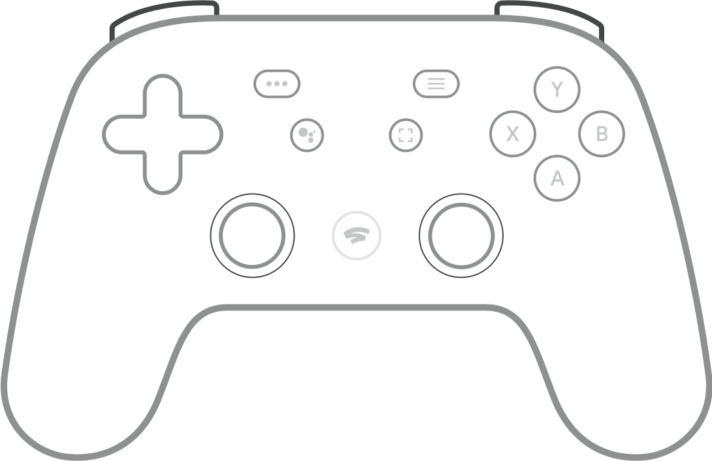
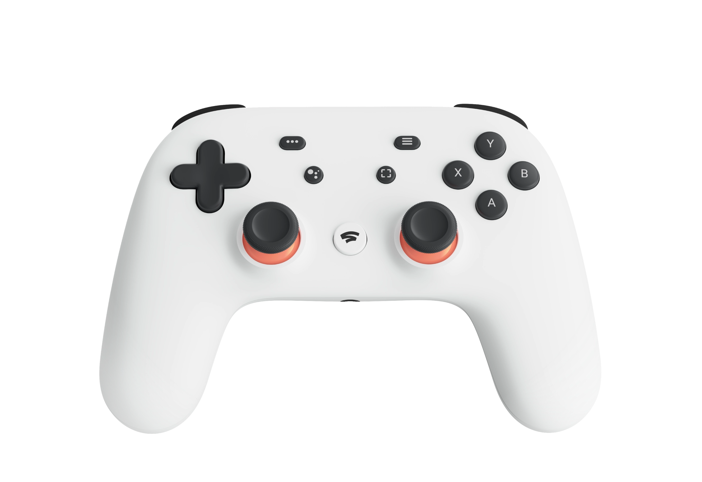
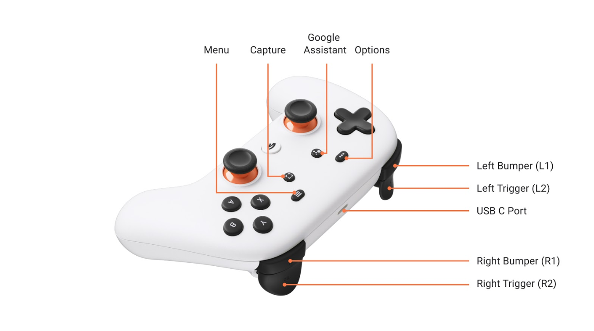
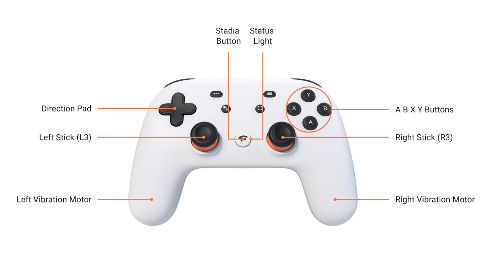
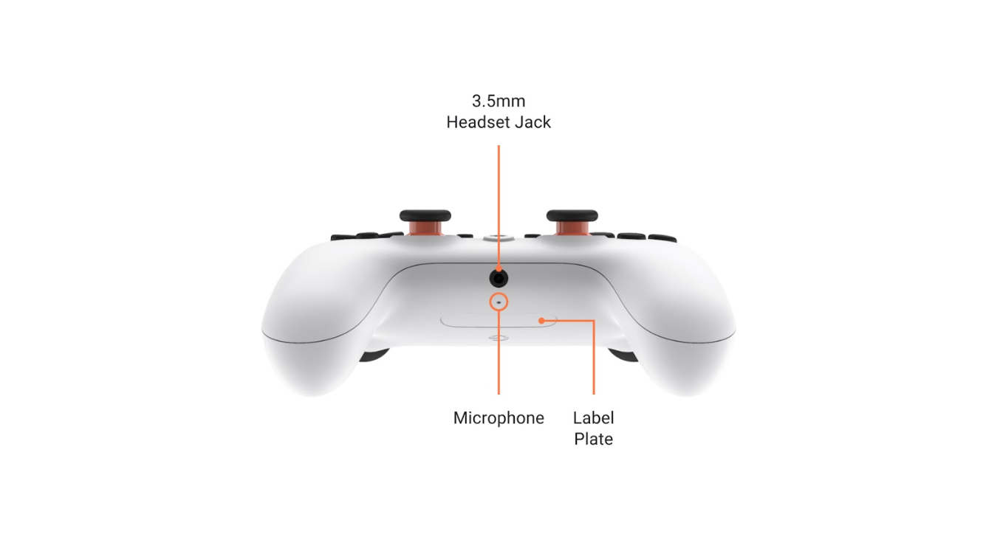

# {{ page.brand }} {{ page.model }}



* Connections:
    * Bluetooth LE 4.2 (vendor id: `18d1`, product id: `9400`)
    * USB-C (vendor id: `18d1`, product id: `9400`)
* 3.5mm headphone jack can be used when the controller is connected via USB.
* Weight: 268g
* [Google Stadia service was shut down on January 2023](https://web.archive.org/web/20230602175401/https://support.google.com/stadia/answer/9578631). Existing controllers can have [a firmware update to enable Bluetooth mode](https://web.archive.org/web/20230603213743/https://stadia.google.com/controller/). All the buttons are available as standard buttons, as they can no longer activate the assistance, nor capture a screenshot, nor launch Stadia.
* Official documentation (archived):
    * [Stadia Controller features and specifications](https://web.archive.org/web/20230603175647/https://support.google.com/stadia/answer/9565956)
    * [Connect your Stadia Controller to a device](https://web.archive.org/web/20230603175750/https://support.google.com/stadia/answer/13067284)
    * [Troubleshoot the Stadia Controller](https://web.archive.org/web/20230603175708/https://support.google.com/stadia/answer/9584135)

## Power-on (Bluetooth)

Hold for...        | Action                                | Status light
------------------ | ------------------------------------- | ------------
STADIA      for 2s | Reconnect to the last device          | Blinking white
STADIA + Y  for 2s | Bluetooth pairing                     | Blinking orange

Status light is solid white when connected.

When already connected to one device via Bluetooth, it is possible to hold STADIA + Y to pair/connect to a different device.

It is also possible to first connect to a device via Bluetooth, and afterwards plug the USB-C cable for charging.

## Power-off

Automatically turns off after 25 minutes without activity.

Hold for...   | Action
------------- | ------
STADIA for 4s | Power off
STADIA for 8s | Force power off

## Factory reset

While the controller is on, press and hold ASSISTANT + CAPTURE buttons for 6 seconds, until the controller starts vibrating.

## Battery

2000mAh Li-Ion. Status light is solid orange while charging.

Note: There are no official specifications of battery capacity or battery duration or charging time. We can see [internal photos](https://fccid.io/A4RH2B/Internal-Photos/Internal-Photos-4297201) of the device at [FCC website](https://apps.fcc.gov/oetcf/eas/reports/ViewExhibitReport.cfm?mode=Exhibits&RequestTimeout=500&calledFromFrame=N&application_id=SC%2BtBLL5FvCneBfFANJIYw%3D%3D&fcc_id=A4RH2B). There are also some [disassembly and replacement guides at iFixit](https://www.ifixit.com/Device/Google_Stadia_Controller).

## Tandem mode

Tandem mode allows connecting a second controller via USB to the Stadia controller, while the Stadia controller is connected via Bluetooth to a gaming computer (be it a video-game console, a PC, an Android device, etc.). In other words:

> Host system ← Bluetooth ← Stadia controller ← USB ← secondary controller

In this mode, the inputs from both controllers are combined, and reported together as a single controller to the main system. This is a great feature for accessibility: if one player is not able to perform certain actions on one controller, two controllers can be connected together so two players can play the game together as if they were one single player.

How to use:

1. Make sure both controllers are charged.
2. Connect the Stadia controller via Bluetooth to the main system.
3. Use a USB cable to connect the secondary controller to the Stadia Controller.
    * Stadia controller ← USB-C to USB-C cable ← secondary controller
    * Stadia controller ← USB-C to USB-A adapter ← USB-A cable ← secondary controller

Very few controllers are supported for Tandem mode:

| Secondary controller                       | vibration | Vendor ID:Product ID (VID:PID)  |
| ------------------------------------------ | --------- | ------------------------------- |
| Sony DualSense® Controller                 | supported | 054c:0ce6                       |
| Sony DualShock 3 Controller                | no        | 054c:0268                       |
| Sony DualShock® 4 Controller               | supported | 054c:05c4, 054c:09cc            |
| Stadia Controller                          | supported | 18d1:9400                       |
| Switch Pro Controller                      | no        | 057e:2009                       |
| Valve Steam Controller Wireless Adapter    | no        | 28de:1142                       |
| Valve Steam® Controller                    | no        | 28de:1102                       |
| Xbox 360 Controller Wireless Adapter       | no        | 045e:0719                       |
| Xbox 360® Wired Controller                 | no        | 045e:028e                       |
| Xbox Adaptive Controller                   | no        | 045e:0b0a                       |
| Xbox One Elite Controller (Series 1 and 2) | supported | 045e:02e3, 045e:0b00            |
| Xbox One® Controller                       | supported | 045e:02d1, 045e:02dd, 045e:02ea |
| Xbox® Series X/S™ Controllers              | supported | 045e:0b12                       |

Note: To use vibration on the primary controller in Tandem Mode, hold the down button on the Dpad while connecting the second controller and then hold it for 3 seconds after connecting.

## Additional udev rules for Linux systems

These rules are based on the [official support page](https://web.archive.org/web/20230603175750/https://support.google.com/stadia/answer/13067284#zippy=%2Cim-on-a-linux-based-computer-and-cant-update-my-stadia-controller-help) and [some user investigation](https://web.archive.org/web/20230603175750/https://support.google.com/stadia/answer/13067284#zippy=%2Cim-on-a-linux-based-computer-and-cant-update-my-stadia-controller-help). They are also [available](https://codeberg.org/fabiscafe/game-devices-udev/src/branch/main/71-google-controllers.rules) as part of [game-devices-udev](https://codeberg.org/fabiscafe/game-devices-udev) project.

Please add this to `/etc/udev/rules.d/70-stadiacontroller.rules`:

```conf
# /etc/udev/rules.d/70-stadiacontroller.rules

# Google Stadia Controller; Bluetooth; USB
KERNEL=="hidraw*", KERNELS=="*18D1:9400*", MODE="0660", TAG+="uaccess"
KERNEL=="hidraw*", ATTRS{idVendor}=="18d1", ATTRS{idProduct}=="9400", SUBSYSTEM=="hidraw", MODE="0660", TAG+="uaccess"
SUBSYSTEMS=="usb", ATTRS{idVendor}=="18d1", ATTRS{idProduct}=="9400", MODE="0660", TAG+="uaccess"

# Google Stadia Controller Update
# SDP protocol
KERNEL=="hidraw*", ATTRS{idVendor}=="1fc9", MODE="0660", TAG+="uaccess"
ACTION=="add", SUBSYSTEM=="usb", ATTR{idVendor}=="1fc9", MODE="0660", TAG+="uaccess"
ACTION=="add", SUBSYSTEM=="usb", ATTR{idVendor}=="0d28", MODE="0660", TAG+="uaccess"
# Flashloader
KERNEL=="hidraw*", ATTRS{idVendor}=="15a2", MODE="0660", TAG+="uaccess"
```

Next, run the following command:

    sudo udevadm control --reload-rules && sudo udevadm trigger

## Firmware update procedure

You shouldn't need to do it manually. These instructions are here for completeness. The [firmware update page](https://stadia.google.com/controller/) will have the step-by-step instructions.

1. Unplug the controller and power it off.
2. While holding the OPTIONS button `⋯`, use a USB-C cable to plug it to a computer.
    * This will launch the bootloader instead of the default gamepad firmware. It will be recognized as `idVendor=18d1, idProduct=946b`, as a *Bootloader* device from *Google Inc.*.
3. Press at the same time: OPTIONS + ASSISTANT + A + Y.
    * This will allow receiving a new firmware. It will be recognized as `idVendor=1fc9, idProduct=0135`, as a *SP Blank RT Family* device from *NXP      SemiConductors Inc*.
4. Follow the instructions in the firmware update page to load and install the new firmware.
    * After receiving the new firmware, but before installing it, the controller will be recognized as `idVendor=15a2, idProduct=0073`, as a *USB COMPOSITE DEVICE* from *FREESCALE SEMICONDUCTOR INC.*.
5. Finally, after the firmware is installed and the device reboots, it will be recognized again as `idVendor=18d1, idProduct=9400`, as a *Stadia Controller* from *Google LLC*.

You can exit the firmware loading mode by holding the STADIA button for 10 seconds to force the controller to power off.

## More images








