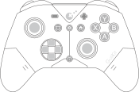
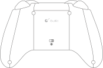

# {{ page.brand }} {{ page.model }}

The *ES* and *ES PRO* models are very similar, with minor differences:

* *ES PRO* uses [TMR](https://en.wikipedia.org/wiki/Tunnel_magnetoresistance) joysticks, while *ES* uses [hall effect](https://en.wikipedia.org/wiki/Hall_effect_sensor) joysticks. Both models use hall effect triggers.
* *ES PRO* comes with a USB-C cable in the box.
* *ES PRO* has more customizations available.

The information of this page is based on the *ES PRO* model.

* Connections: Bluetooth and USB-C
* 950mAh battery (unspecified voltage)
* Weight: 220g
* Official product page:
    * <https://gulikit.com/productinfo/1523654.html>

Mode | Vendor id | Product id | Device name
---- | --------- | -----------| -----------
PC   | 045e      | 028e       | GuliKit X GuliKit X
NS   | 057e      | 2009       | Nintendo Co., Ltd. Pro Controller

## Indicator light

Color  | Meaning
------ | -------
Orange | Charging
Green  | Fully charged
White  | No custom settings configured
Blue   | Some custom settings configured

## Power-on

Press the HOME button to turn it on.

Plugging a USB cable will start charging the controller, but it will not turn on. The HOME button must be pressed even when using a wired connection.

## Power-off

Hold the HOME button between 5 and 10 seconds to turn it off.

Alternatively, quickly press the tiny button at the back, under the PC/NS toggle.

When not connected via cable, the controller will automatically turn off after 15 minutes of inactivity. (Unless Auto-Turbo mode is active.)

## Pairing

After turning the controller on, hold the PAIR button for about 2 seconds. This button is located between the D-pad and the right joystick.

## Gyroscope Calibration

This is only available on *ES PRO* model, this is not available on the basic *ES* model.

This is normally not required. If the gyroscope is functioning normally, there is no need to calibrate it.

With the controller powered on and placed on a flat and stable surface, press and hold these four buttons together: PLUS, MINUS, B, D-pad LEFT. The controller will vibrate once the calibration is completed.

## Customizations

All customizations are done by holding the SETTING button and pressing another button. If any of the settings are different than their default values, the light will be blue instead of white.

Customizations available on both *ES* and *ES PRO* models:

* SETTING + MINUS: Reset all settings
    * Long vibration: All customizations have been reset, the indicator light should now be white.
* SETTING + SCREENSHOT: Joystick dead zone
    * One vibration: Regular dead zone ON mode with high-sampling-rate.
    * Two vibrations: Anti-Snapback mode, a special dead zone mode with low-sampling-rate.
    * Long vibration: (default) Regular dead zone OFF mode with high-sampling-rate.
* SETTING + HOME: Firmware update mode
    * While the controller is turned on and connected via USB, pressing this combination will start the firmware update mode. The controller will show up as a removable USB storage device. Upon copying the appropriate `ES*.bin` file to that drive, the controller will apply the firmware and power itself off.
* SETTING + D-pad UP: Vibration (rumble) intensity
    * One vibration: Weak.
    * Two vibrations: (default) Medium.
    * Three vibrations: Strong.
    * Long vibration: Off.
* SETTING + {A, B, X, Y, R1, R2}: Continuous Fire (Turbo)
    * Note: R1 is labeled "R" and is the shoulder button. R2 is labeled ZR and is the trigger.
    * One vibration: Manual turbo mode, i.e. hold the button to rapid-fire.
    * Two vibrations: Auto turbo mode, i.e. press the button to toggle rapid-fire.
    * Long vibration: (default) Off.

Customizations exclusive to the *ES PRO* model:

* SETTING + PLUS: Button swap
    * One vibration: Swap A-B and X-Y.
    * Long vibration: (default) Standard button assignments.
* SETTING + D-pad RIGHT: 4-direction D-pad mode
    * One vibration: 4-direction mode, i.e. the D-pad doesn't report diagonals anymore.
    * Long vibration: (default) 8-direction mode.
* SETTING + { L3, R3 }: Joystick sensitivity
    * Note: L3 and R3 refer to pressing down the joysticks. Each joystick can be configured individually.
    * One vibration: 50%.
    * Two vibrations: (default) 100%.
    * Three vibrations: 150%.
* SETTING + { L1, L2 }: Motion aim assist for PC FPS games
    * Note: L1 is labeled "L" and is the shoulder button. L2 is labeled ZL and is the trigger.
    * Note: SETTING + L1 will enable motion assist while holding L1 in-game. Likewise, SETTING + L2 will enable motion assist while holding L2 in-game.
    * One vibration: Low-sensitivity aim assist.
    * Two vibrations: Medium-sensitivity aim assist.
    * Three vibrations: High-sensitivity aim assist.
    * Long vibration: (default) Off.
