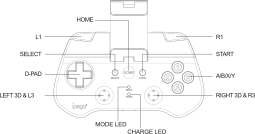

# {{ page.brand }} {{ page.model }}

* [Product page](http://ipega.hk/gamehandle/53-120.html)
* [Manual](http://ipega.hk/uploads/201806/5b2cb09d54326.pdf)
* Connections: Bluetooth

The manual claims it also works through USB Micro, but that's either not true, or requires a newer firmware (but there is no documented way to upgrade the firmware).

## Modes

Use these combinations any time, even while connected.

Combination  | Mode
------------ | ----
HOME + X     | HID gamepad
HOME + B     | Mouse
HOME + A     | Keyboard
HOME + Y     | iCade

## Firmware update (Dangerous!)

There is also a firmware update mode: hold START + SELECT then connect the USB cable. However, there is no firmware available on the official website, and there is no way to get out of the firmware update mode. Not even resetting the gamepad. If you enter this mode, the device will be bricked.

## Power-off

Automatically turns off after 5 minutes without activity.

Hold for... | Action
----------- | ------
HOME for 3s | Power off

## Battery

380mAh, 10 hours of play time.

Charge LED   | Meaning
------------ | -------
Solid        | Charging
Off          | Fully charged

## See also

* <https://gist.github.com/rstacruz/d56f3834e0e2a7979c1fa47d61b24d0c>
