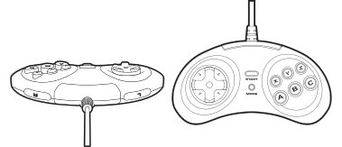

# {{ page.brand }} {{ page.model }}

* [Product page](http://retro-bit.com/sega-collaboration)
* [Product page (Europe)](http://retro-bit.com/sega-collaboration-eu/)
* [Manual](http://retro-bit.com/controllers-support)
* Connections: USB-A cable (3 meters)

## Overview

This is a wired gamepad that looks and feels like the original 6-button SEGA Mega Drive controllers. However, while the original controller had a single shoulder button called MODE, this modern controller has two shoulder buttons (L and R), and the MODE button was moved next to the START button.

This controller is available in two colors:

* Black
* Clear blue (transparent)

This controller is known as:

* SEGA Genesis 8-Button Arcade Pad with USB (for USA market, SKU RB-SGA-003 and RB-SGA-004)
* SEGA Mega Drive 8-Button Arcade Pad with USB (for Europe market, SKU RET00125 and RET00126)

## Button remapping

Hold for 5s   | Mapping
------------- | -------
START + UP    | Map D-pad as D-pad (hat)
START + LEFT  | Map D-pad as left analogue stick
START + RIGHT | Map D-pad as right analogue stick
START + DOWN  | Swap A-B and X-Y
START + B     | Toggle between Xinput and Dinput modes

## Other mappings

Button    | Dinput | Xinput | Switch
--------- | ------ | ------ | ------
A         | 2      | A      | A
B         | 3      | B      | B
X         | 1      | X      | X
Y         | 4      | Y      | Y
Z         | 6      | LT/L2  | ZL
C         | 5      | RT/R2  | ZR
L         | 7      | LB/L1  | L
R         | 8      | RB/R1  | R
MODE      | 9      | SELECT | MINUS
START     | 10     | START  | PLUS
START + A | GUIDE  | GUIDE  | HOME
