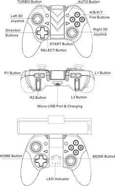

# {{ page.brand }} {{ page.model }}

* The manufacturer is known as Saitake.
* The USB vendor id is known as ZhiXu.
* [User manual](http://cdn.cnetcontent.com/b9/ba/b9ba3e9a-e622-4c49-92ce-56a1fab5763c.pdf) (with different branding)
* Connections: Bluetooth and USB-micro

## Power-on modes (Bluetooth)

Hold for...        | Mode                                   | LEDs
------------------ | -------------------------------------- | ----
HOME        for 1s | Reconnect using the last selected mode | Blinking slowly (2Hz)
HOME        for 6s | Pair using Android mode                | LED 1 blinks fast (4Hz)
HOME + MODE for 6s | Pair using iOS/iCade mode              | LED 3 blinks fast (4Hz)

The Android mode is the normal gamepad behavior that everyone expects.

The iOS/iCade mode maps each button or axis press or release to a different keyboard key. It's mostly useless.

## Power-off

Automatically turns off after about 10 minutes without activity.

Hold for... | Action
----------- | ------
HOME for 3s | Power off
HOME for 8s | Force power off (usually by accident when trying to pair the controller)

## Battery

300mAh Li-Ion, 1.5 hours of charging time, 6-10 hours of play time.

## LED indicators

LEDs           | State
-------------- | -----
LED 1 + LED 4  | Gamepad mode, analog mode
LED 1          | Gamepad mode, digital mode (swaps the left stick and the D-pad)
LED 2          | Mouse/media mode
LED 3          | iOS/iCade mode
LED 4 blinking | Low battery, or charging the battery, or connected through USB
LED 4 fast blinking | Turbo is active

## Android gamepad mode toggles

Button                 | Effect
---------------------- | ------
HOME                   | Toggles between analog mode and digital mode (swaps the left stick and the D-pad)
MODE                   | Switch to mouse/media mode
TURBO + button/trigger | Toggle *turbo* for that button (repeat the button press several times per second while the button is held down)
AUTO  + button/trigger | Toggle *auto-turbo* for that button (repeat the button press several times per second even after the button is released)

## Android mouse/media mapping

Button                 | Action
---------------------- | ------
Left stick             | Mouse pointer movement
L1/R1 (buttons)        | Left/right mouse click
A/B                    | Left/right mouse click
X                      | Enter key
Y                      | Play/pause
L2/R2 (triggers)       | Lower/raise audio volume
Right stick down/up    | Lower/raise audio volume
Right stick left/right | Previous/next track
D-pad                  | Arrow keys
L3 (left stick press)  | Left arrow key
R3 (right stick press) | Right arrow key
SELECT                 | Browser back key
START                  | XF86MenuKB (context menu? Android menu button? unknown key?)
HOME                   | Browser home (go to home page)
MODE                   | Switch back to gamepad mode
